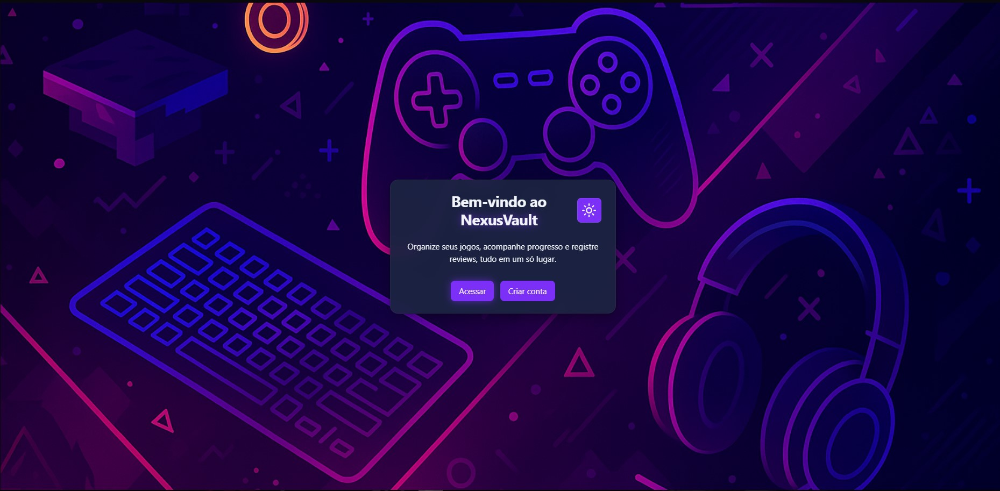
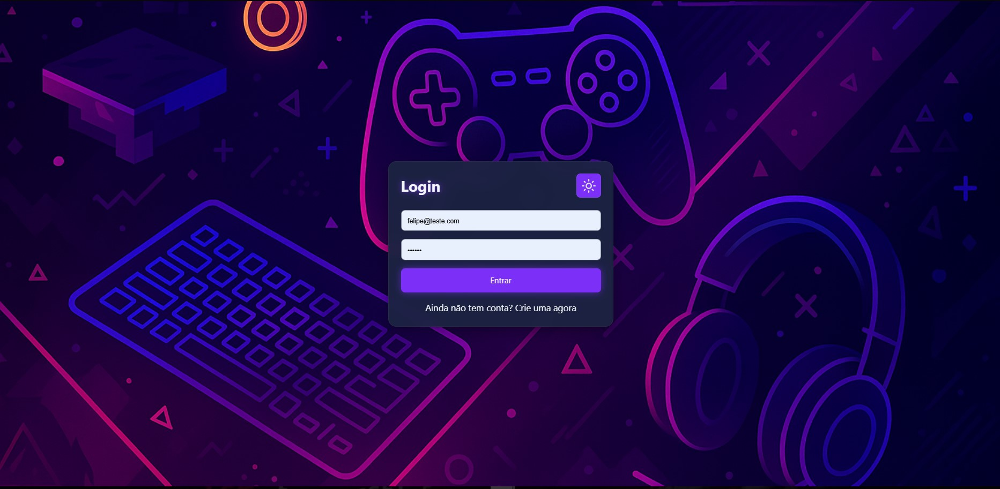
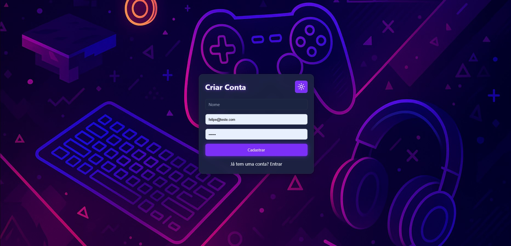
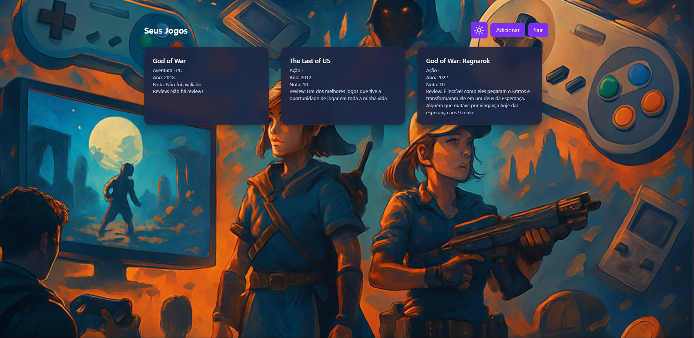
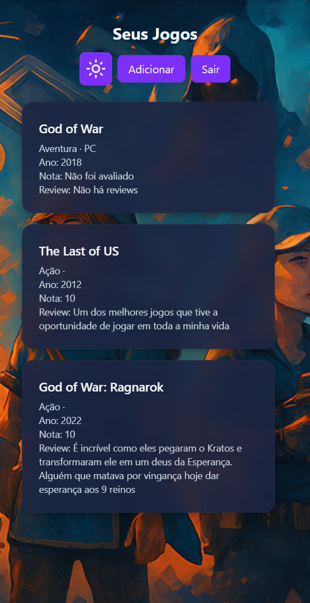
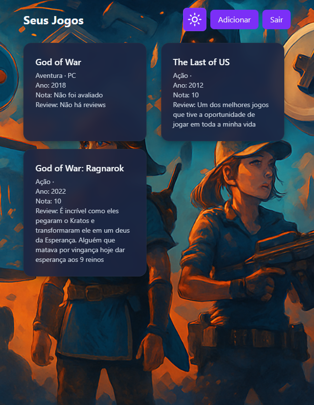

# 🎮 NexusVault UI  

**Interface moderna, imersiva e responsiva para gerenciamento de jogos pessoais, conectada à API NexusVault.**

---

## 🧠 Sobre o Projeto  

O **NexusVault UI** é uma aplicação web desenvolvida em **React + TypeScript**, projetada para que jogadores possam cadastrar, revisar e acompanhar seus jogos favoritos em um ambiente intuitivo e visualmente agradável.  

Com **integração direta à API NexusVault**, a interface oferece:  
- 🔐 Autenticação segura via JWT  
- 🎮 Cadastro e gerenciamento de jogos pessoais  
- 🗒️ Reviews personalizadas  
- 🌗 Modo claro/escuro dinâmico e persistente  

---

## 🛠️ Tecnologias Utilizadas  

| Tecnologia | Função |
|-------------|--------|
|  | Base da interface com tipagem forte e modular
 | Base da interface com tipagem forte e modular
 | Build rápido, leve e eficiente
 |  Estilização moderna, responsiva e fácil de manter
 | Comunicação com a API NexusVault
 |  Navegação entre rotas sem recarregar a página
 |  Gerenciamento global de autenticação
 | Autenticação e autorização seguras de usuários


---

## 🎯 Objetivos  

- Criar uma interface leve, acessível e imersiva para gamers  
- Implementar um fluxo completo de **login, cadastro e dashboard**  
- Permitir **reviews personalizadas** para cada jogo  
- Garantir **autenticação JWT** e comunicação segura com o back-end  

---

## 🧩 Estrutura do Projeto  

```
📁 src/
 ├─ assets/         → imagens, fundos e ícones  
 ├─ components/     → botões, inputs e ThemeToggle  
 ├─ contexts/       → gerenciamento global (AuthContext)  
 ├─ pages/          → Home, Login, Register, Dashboard, AddGame  
 ├─ services/       → integração com API via Axios  
 ├─ styles/         → configurações globais de tema  
 └─ main.tsx        → ponto de entrada da aplicação  
```

---

## 🖼️ Prévia Visual  

### 🏠 Tela Inicial  
Interface de boas-vindas com **design gamer** e botões de acesso/cadastro.  


### 🔐 Login e Cadastro  
Formulários minimalistas com **feedback de erro**, **validação** e **autenticação JWT** integrada.  

 

### 🎮 Dashboard  
Área principal com todos os jogos cadastrados, incluindo **review**, **nota** e **ano de lançamento**.  
Cards com **efeito glassmorphism**, **modo dark/light** e **layout 100% responsivo**.  


---

## ⚙️ Funcionalidades  

✅ Autenticação via **JWT**  
✅ Criação de conta e **login seguro**  
✅ **Cadastro e gerenciamento** de jogos  
✅ **Reviews personalizadas** por usuário  
✅ Alternância de **tema claro/escuro**  
✅ Interface **totalmente responsiva**  
✅ Comunicação direta com a **API NexusVault**

---

## 📱 Responsividade  

O layout foi otimizado para:  
📱 **Smartphones**  


💻 **Tablets**  


As fontes, espaçamentos e componentes se adaptam automaticamente ao viewport, garantindo **consistência e legibilidade** em qualquer dispositivo.  

---

## 🚀 Como Executar  

```bash
# 1️⃣ Clonar o repositório
git clone https://github.com/Guilherme-Henry-Dev/nexusvault-ui.git
cd nexusvault-ui

# 2️⃣ Instalar dependências
npm install

# 3️⃣ Configurar variáveis de ambiente
# Crie um arquivo .env na raiz do projeto com:
VITE_API_URL=https://nexusvault-api.onrender.com

# 4️⃣ Rodar o servidor local
npm run dev
```

🔗 Acesse em: [http://localhost:5173](http://localhost:5173)

---

## 🌍 Deploy  

- **Front-End:** [nexusvault-ui.vercel.app](https://nexusvault-ui.vercel.app)  
- **Back-End:** [nexusvault-api.onrender.com](https://nexusvault-api.onrender.com)

---

## 📦 Status do Projeto  

| Versão | Status | Próximas Melhorias |
|---------|---------|--------------------|
| 🟢 **1.0** | Estável e funcional | ✏️ Edição de jogos <br> 🖼️ Imagens personalizadas <br> 🏷️ Sistema de tags e filtros |

---

## 👨‍💻 Autor  

**Guilherme Henry**  
💼 Desenvolvedor Fullstack com foco em Front-End  
📍 Belo Horizonte - MG  

[💻 GitHub](https://github.com/Guilherme-Henry-Dev)
[🔗 LinkedIn](https://www.linkedin.com/in/guilherme-henry-dev)
[💻 Portifólio](https://portifolio-guilherme-nu.vercel.app)
